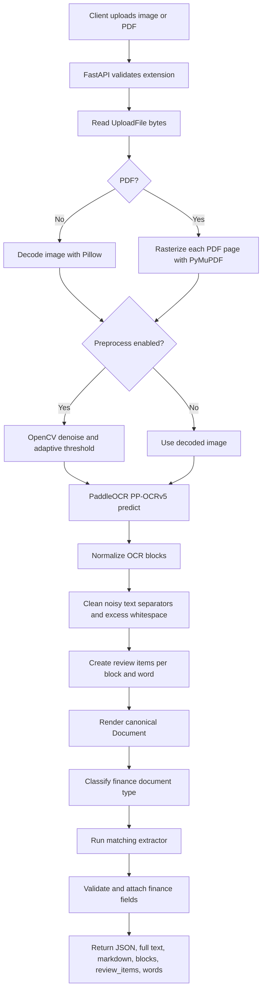
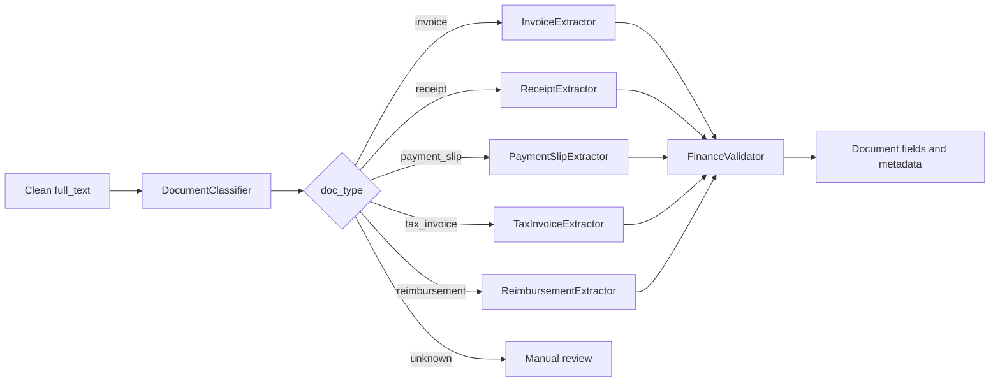
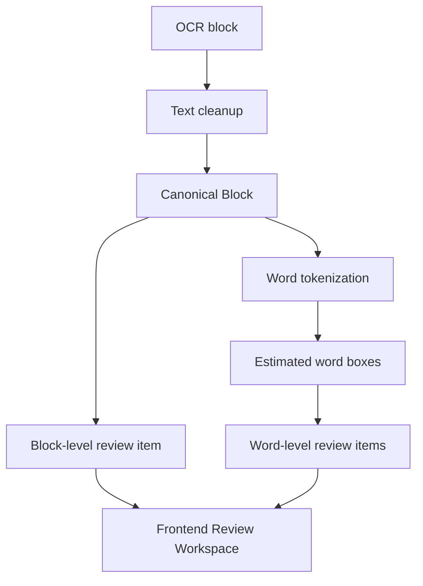

# Flow System

This document describes the backend processing flow from upload to response.

## OCR Flow



```text
1. Client uploads image/PDF
2. API validates filename extension
3. API reads file bytes
4. OCREngine decides image vs PDF flow
5. Image flow:
   - PIL decodes bytes
   - image is converted to NumPy
   - optional preprocessing runs
   - PaddleOCR PP-OCRv5 `predict()` extracts boxes, text, confidence
6. PDF flow:
   - PyMuPDF opens PDF bytes
   - each page is rasterized using `OCR_PDF_DPI`
   - optional preprocessing runs per page
   - PaddleOCR PP-OCRv5 `predict()` extracts boxes, text, confidence per page
7. OCR blocks are cleaned:
   - decorative separators are removed
   - excessive internal whitespace is collapsed
   - raw text is preserved when cleanup changes text
8. Clean OCR blocks become canonical `Block` objects
9. Review data is generated per block and per word
10. Full text is rendered from canonical blocks
11. DocumentClassifier predicts document type
12. Matching extractor creates finance data
13. Data is attached to document metadata and fields
14. API returns JSON, markdown, full text, fields, blocks, review_items, words, and processing time
```

## Classification Flow

```text
full_text
  -> lowercase normalization
  -> keyword scan per document type
  -> regex pattern scan per document type
  -> weighted score
  -> confidence threshold
  -> invoice | receipt | payment_slip | tax_invoice | reimbursement | unknown
```

The classifier is intentionally deterministic. This is useful for auditability and privacy because there is no external model call.

## Extraction Flow



```text
doc_type
  -> _get_extractor(doc_type)
  -> extractor.extract(full_text)
  -> field regexes
  -> validation
  -> ExtractionResult
  -> Document.fields + Document.metadata["finance_data"]
```

## Validation Flow

Validation currently checks:

- amount values are numeric and positive
- dates match known date formats
- NPWP has 15 digits after formatting is removed
- tax calculation consistency
- invoice number existence
- bank account number shape
- currency code support

## Recommended Confidence Handling

Use confidence as a workflow signal:

| Condition | Suggested behavior |
| --- | --- |
| `doc_type == unknown` | Send to manual review or optional LLM review |
| classification confidence below 40 | Do not auto-approve classification |
| critical fields missing | Keep document in review queue |
| OCR block confidence below 0.75 | Mark extracted field as uncertain |
| validation errors present | Require human review |

## Failure Modes

| Failure | Likely cause | Mitigation |
| --- | --- | --- |
| Missing text | blurry image, low DPI, bad lighting | improve capture quality, raise PDF DPI, avoid aggressive thresholding |
| Wrong text recognition | recognition model does not fit the document set | evaluate `OCR_REC_MODEL=latin_PP-OCRv5_mobile_rec` on Indonesian samples |
| Wrong document category | weak keywords or OCR spelling errors | improve classifier patterns and add evaluation samples |
| Missing fields | layout varies from regex assumptions | use spatial blocks or add a key-value parser |
| Slow PDFs | many pages rasterized and processed sequentially | add page limits, async job queue, or batch processing |

## Operational Flow

```text
make backend
  -> scripts/start-backend.bat
  -> python main.py
  -> FastAPI on localhost:8001
```

Diagnostics:

```http
GET /api/health
```

The health response includes the active detection model, recognition model, device, PDF DPI, preprocessing, and finance extraction settings.

## Review Flow



The API returns both `review_items` and flat `words`. Use `review_items` for block-by-block correction screens and `words` for token-level highlighting or confidence review.

## Model Flow

```text
OCR_DET_MODEL=PP-OCRv5_mobile_det
OCR_REC_MODEL=PP-OCRv5_mobile_rec
OCR_TEXTLINE_ORIENTATION=false
OCR_DOC_ORIENTATION_CLASSIFY=false
OCR_DOC_UNWARPING=false
OCR_RETURN_WORD_BOX=true
OCR_DEVICE=cpu
OCR_PDF_DPI=150
  -> PaddleOCR(...)
  -> predict(input=image_np)
  -> rec_texts + rec_scores + rec_polys/rec_boxes
  -> normalized OCR words
  -> Document blocks
```
